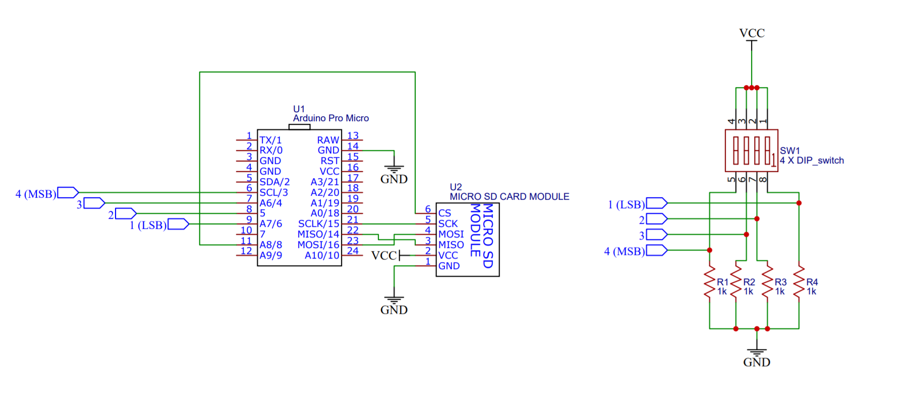
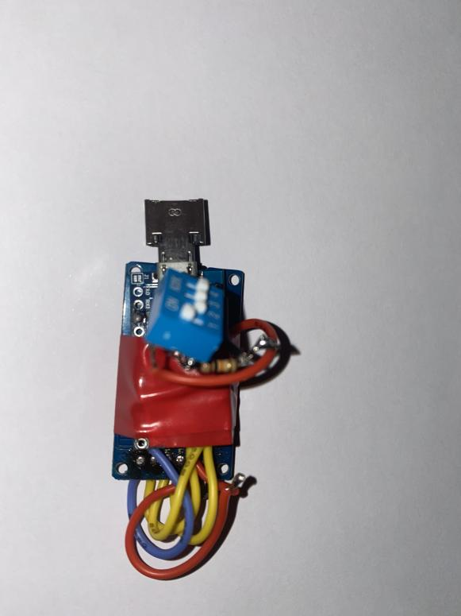
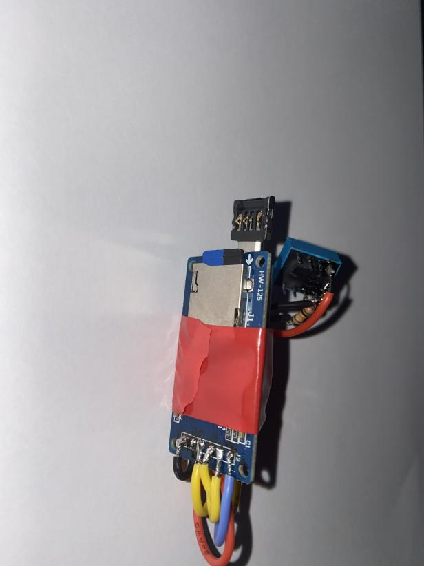

# MaliciousDucky
This is a for "fun" project which I worked on back in 2017 to familiarize myself with microcontrollers. The urge to create this was due to how absurdly expensive HAK5's Rubber Ducky is, given how cheap the hardware it runs on. I have added few more imporvements to make it versatile such as implementing an SD card to store mutiple scripts and a 4-bit DIP switch to allow the user to pick a certain script. I have included two test scripts with the code. 

**Note: The scripting language differs a bit from Rubber Ducky's scripting language.**

# Bill of Materials:

1x Cheap Chinese Arduino Pro Mini (Running a XXXX microcontroller) - $2.20.

1x Cheapest 4-bit DIP switches you can ever find - $0.10.

4x 1k+ resistors to act as pull down resistor - literally worhtless (probably pennies). 

1x MicrorSD card reader module running on SPI - $0.40.

1x Micro USB OTG (Male to Male) - $0.10.

# Scehamtics 

# Construction
After soldering and desoldering this completely twice. I managed to indentify that I mixed MOSI with MISO, so don't judge my soldering skills at that points, I just wanted to be done, didn't care if it "didn't look good enough" AND NO I'M NOT GONNA CLEAN UP THAT SOLDER RESIDUE AND NO IT WONT SHORT THING OUT.

**P.S: WATCH OUT FOR MOSI AND MISO.**

## Front:

## Back:

# Video

# Disclaimer
I am not responsbile for anything malicious you do with my code, device or schematics.
Also, don't use my code in anything to be sold or given out in a product or a device that I haven't agreed to.
